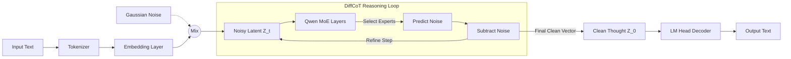

# 🧠 DiffCoT-MoE: Diffusion of Thought on Mixture-of-Experts

> **A PyTorch implementation of Latent Diffusion Reasoning attached to the Qwen-1.5-MoE-A2.7B model.**

## 📖 Overview
This project explores a novel architecture that combines **Sparse Mixture-of-Experts (MoE)** with **Diffusion Models**. Instead of generating text one token at a time (autoregressive), this model attempts to "diffuse" a complete thought vector from random noise, allowing for global planning and reasoning before outputting text.

This implementation was built to run on **free-tier GPU constraints (T4 16GB)** using 4-bit Quantization and custom device-agnostic memory management.

## 🚀 Key Features
* **Base Model:** `Qwen/Qwen1.5-MoE-A2.7B` (Sparse MoE).
* **Architecture:** Custom `DiffusionMoE` head attached to the embedding latent space.
* **Training Objective:** Denoising Score Matching (predicting noise added to reasoning traces).
* **Optimization:**
    * 4-bit Quantization (`bitsandbytes` NF4).
    * Automatic CPU/GPU offloading for embedding layers.
    * Stabilized Loss Calculation (NaN prevention via clamping).
* **Dataset:** GSM8K (Grade School Math) for reasoning tasks.

## 🛠️ Tech Stack
* **Python 3.10+**
* **PyTorch** (Custom Module Logic)
* **HuggingFace Transformers** (Model Loading)
* **BitsAndBytes** (QLoRA/Quantization)
* **Accelerate** (Device Management)

## 💻 Installation

```bash
pip install -r requirements.txt
